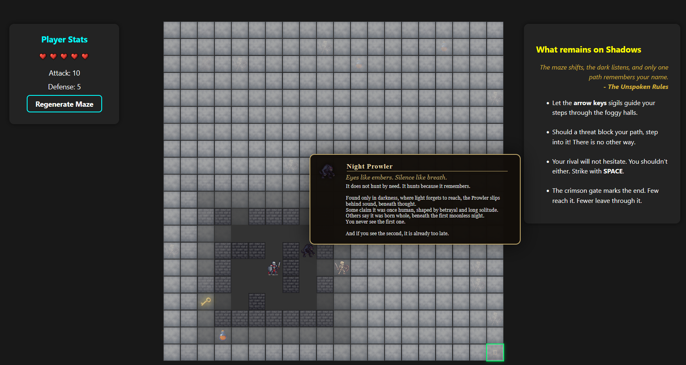

# What Remains in Shadow

A fantasy maze adventure game built with React, TypeScript, and Vite, it is loosely based on RPG soulsborne style.

You can see it live here: [https://salmon-pebble-04158191e.1.azurestaticapps.net/](https://salmon-pebble-04158191e.1.azurestaticapps.net/)

---

## Game Overview


**What Remains in Shadow** is a single-player, atmospheric maze adventure. You play as "The Woken Blades," navigating a shifting labyrinth haunted by supernatural threats. Your goal: find the Stained Exit Key and escape alive.




---

## Game Mechanics

### Maze Generation
- The maze is a 20x20 grid, generated using recursive backtracking for a unique layout each game.
- The entrance (top-left) and exit (bottom-right) are always open and connected.
- Extra walls are randomly removed to ensure the maze is challenging but solvable, with a balance between open paths and dead ends.

### Fog of War
- The maze is covered by a fog that hides all but the area around the player.
- Visibility fades with distance: cells close to the player are clear, while distant cells are fully obscured.
- The fog updates as you move, encouraging exploration and caution.

### Movement
- Use the arrow keys to move through open paths.
- You cannot move through walls or outside the maze.

### Encounters & Mobs
- Mobs (enemies) are randomly placed in the maze, never on the start/end, and always at least 2 cells apart.
- Types of mobs:
  - **Rustling Bones**: A haunted, armored skeleton.
  - **Night Prowler**: A silent, predatory beast.
  - **The Maw Below**: A rare, devastating threat.
- If you step onto a mob, a roulette modal appears, determining the outcome (damage, escape, or other effects).

### HP Vials
- HP vials are scattered in the maze. Collecting one triggers a roulette for possible healing or other effects.

### The Key & Exit
- The Stained Exit Key is hidden in a random cell (never start/end, never on a mob or vial).
- You must find the key before you can exit the maze.
- Reaching the exit without the key triggers a sealed gate modal.

### Health & UI
- Your health is shown as a heart bar. If it reaches zero, you lose.
- The UI features modals for encounters, win/lose states, and lore popups for each entity.

---

## Lore

### Rustling Bones
> Even hollow, it remembers the path.

The stance is practiced, though no will guides it.
Armor rusted away, name long vanished, it moves as if mid-quest… or mid-regret.
Some whisper it once stood where no one else would.  
Others say it simply forgot how to fall.
Whatever it was, it is not that anymore.
Now, it only serves the silence.

---

### Night Prowler
> Eyes like embers. Silence like breath.

It does not hunt by need. It hunts because it remembers.
Found only in darkness, where light forgets to reach, the Prowler slips behind sound, beneath thought.
Some claim it was once human, shaped by betrayal and long solitude.  
Others say it was born whole, beneath the first moonless night.
You never see the first one.
And if you see the second, it is already too late.

---

### Unmarked Vial
> Strength is never given. Only borrowed.

A thick, crimson draught sealed in clouded glass. It pulses faintly, as if remembering a heartbeat long gone.
No label, no maker—only the weight of the hand that dares to hold it.
Those who drink speak of power, of clarity, of triumph.
None speak of what comes after.

---

### The Woken Blades
> One walks now. Many have.

They arrive alone, yet never for the first time.
No banner, no face, no past—only steel worn smooth by repetition.
The halls shift for them, not in welcome… but in memory.
Some reached the throne.  
None were remembered.
Another rises.

---

### The Maw Below
> It does not dig. The world gives way.

No record speaks of when it first moved, only of the stone that vanished around it.
Miners tell tales of heat, breathless tremors, and soil that weeps.
Entire caverns gone.
No bones. No light.
Some say it sleeps.
Others say it listens.
The ground, it seems, remembers how to open.

---

### Cursed Monk
> Its prayers were never answered. Still, it whispers.

Bound in silence by its own faith, the flesh gave way — but the curse endured.
What remains is not devotion, but the echo of devotion.
It speaks in rot. It breathes through others.
Where it kneels, the dead do not rest.

---

### Stained Exit Key
> There are always two — one is found, the other taken.

The iron is worn smooth from hands long vanished.
The stains are old. Some say blood, some say rust.
It opens the way forward, or back—depending who turns it.
Few keep it. Fewer return with it.

---

## Developer's Guide: How to Build This Game

### Prerequisites
- Node.js (v18+ recommended)
- npm (comes with Node.js)

### 1. Project Setup
```bash
# Clone the repository
git clone https://github.com/yourusername/what-remains-in-shadow.git
cd what-remains-in-shadow

# Install dependencies
npm install
```

### 2. Development
```bash
# Start the development server
npm run dev
# Open the provided local URL in your browser
```

### 3. Project Structure
- `src/` — Main source code (React components, logic, assets)
- `public/` — Static files (images, routes)
- `mob-data/` — Mob configuration (min/max, outcomes)
- `assets/` — Game art and icons
- `lore.md` — Lore text for in-game popups

### 4. Maze Generation
- See `Maze.tsx` for the maze generation algorithm (recursive backtracking).
- Maze density can be tuned by adjusting the percentage of extra walls removed.

### 5. Mob & Item Placement
- Mobs are placed with minimum distance constraints (see `placeMobs` in `Maze.tsx`).
- HP vials and the key are placed in random, valid cells.

### 6. Game Logic
- Player movement, fog of war, and encounter logic are handled in `Maze.tsx`.
- Battle outcomes are defined in `mob-data/*.json` and handled by the roulette modal.

### 7. Customization
- Add new mobs by creating a new JSON file in `mob-data/` and updating `MOB_CONFIG` in `Maze.tsx`.
- Update lore by editing `lore.md`.
- Change maze size by modifying the `MAZE_SIZE` constant.

### 8. Build for Production
```bash
npm run build
```
The output will be in the `dist/` folder.

### 9. Deployment
- Deploy the `dist/` folder to any static hosting service (Vercel, Netlify, GitHub Pages, etc).

---


For questions or contributions, open an issue or pull request!

---

# React + TypeScript + Vite

This template provides a minimal setup to get React working in Vite with HMR and some ESLint rules.

Currently, two official plugins are available:

- [@vitejs/plugin-react](https://github.com/vitejs/vite-plugin-react/blob/main/packages/plugin-react) uses [Babel](https://babeljs.io/) for Fast Refresh
- [@vitejs/plugin-react-swc](https://github.com/vitejs/vite-plugin-react/blob/main/packages/plugin-react-swc) uses [SWC](https://swc.rs/) for Fast Refresh

## Expanding the ESLint configuration

If you are developing a production application, we recommend updating the configuration to enable type-aware lint rules:

```js
export default tseslint.config([
  globalIgnores(['dist']),
  {
    files: ['**/*.{ts,tsx}'],
    extends: [
      // Other configs...

      // Remove tseslint.configs.recommended and replace with this
      ...tseslint.configs.recommendedTypeChecked,
      // Alternatively, use this for stricter rules
      ...tseslint.configs.strictTypeChecked,
      // Optionally, add this for stylistic rules
      ...tseslint.configs.stylisticTypeChecked,

      // Other configs...
    ],
    languageOptions: {
      parserOptions: {
        project: ['./tsconfig.node.json', './tsconfig.app.json'],
        tsconfigRootDir: import.meta.dirname,
      },
      // other options...
    },
  },
])
```

You can also install [eslint-plugin-react-x](https://github.com/Rel1cx/eslint-react/tree/main/packages/plugins/eslint-plugin-react-x) and [eslint-plugin-react-dom](https://github.com/Rel1cx/eslint-react/tree/main/packages/plugins/eslint-plugin-react-dom) for React-specific lint rules:

```js
// eslint.config.js
import reactX from 'eslint-plugin-react-x'
import reactDom from 'eslint-plugin-react-dom'

export default tseslint.config([
  globalIgnores(['dist']),
  {
    files: ['**/*.{ts,tsx}'],
    extends: [
      // Other configs...
      // Enable lint rules for React
      reactX.configs['recommended-typescript'],
      // Enable lint rules for React DOM
      reactDom.configs.recommended,
    ],
    languageOptions: {
      parserOptions: {
        project: ['./tsconfig.node.json', './tsconfig.app.json'],
        tsconfigRootDir: import.meta.dirname,
      },
      // other options...
    },
  },
])
```
